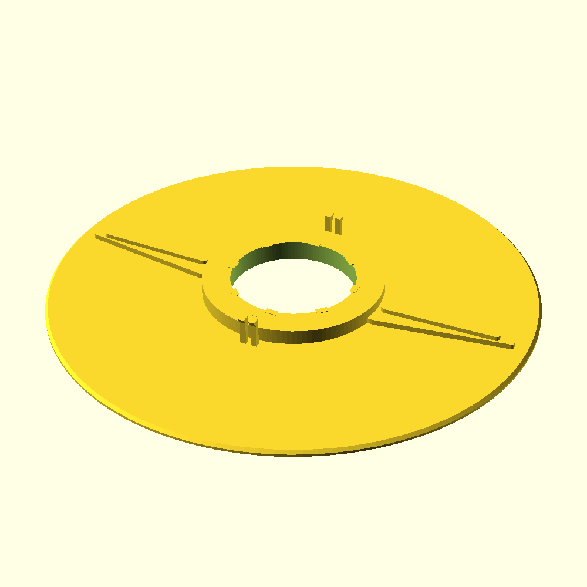
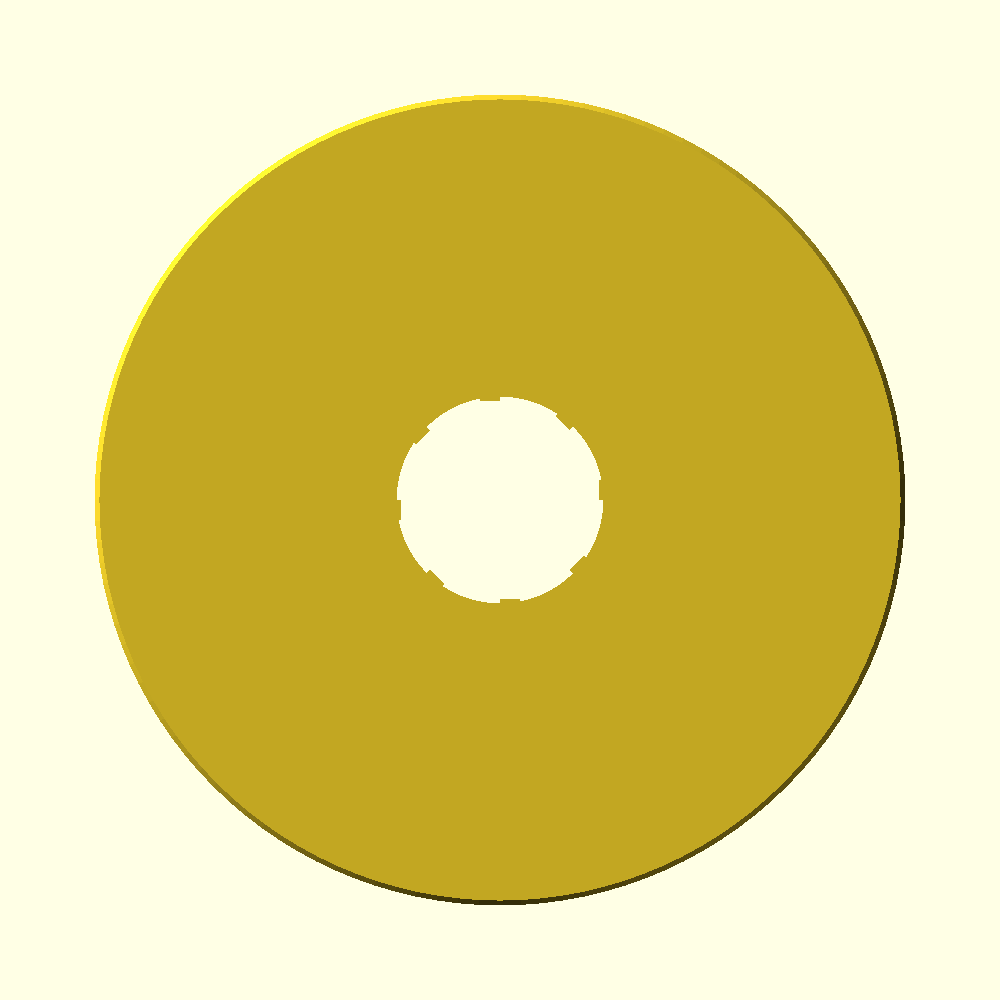

# Automower 440 iQ — Part 547656201 (FRAME) 3D Print Model

Parametric model for **OEM 547 65 62-01** (`547656201`), highlighted on the [Husqvarna 440 iQ support page](https://www.husqvarna.com/us/support/automower-440-iq/?highlightId=547656201-11).

## What this part actually is

Husqvarna's product text calls it a **"Frame Sealing Bellow"**, but the official IPL drawing shows a **thin spoked guard ring** above the cutting disc — not an accordion rubber boot.

| Source | Name / callout |
|--------|----------------|
| IPL diagram | **FRAME** — callout **#13** |
| Support-page highlight URL | `547656201-11` (internal map id; same part) |
| Spare-parts page | "FRAME Sealing Bellow" |

Official diagram image (from Husqvarna spare-parts data):

- Full sheet: `reference/ipl-blade-motor-UN-778162.png` (downloaded from Husqvarna CDN)
- Close-up of callout #13: `reference/part13-frame-closeup.png`
- Annotated overview: `reference/blade-motor-annotated.png`

The part sits in the blade stack above cutting disc **599674701** (240 mm) and latches onto the hub of disc **#6** in the diagram.

## Modeled geometry

Traced feature-by-feature from the IPL diagram:

- **Thin circular plate** with a chamfered outer rim
- **Stepped central hub** with a **castellated (splined) bore** that grips the disc hub for anti-rotation
- **Two tapered fins** (East–West, 180° apart) with a raised central spine and a small **alignment hole** near each hub end
- **Two twin-prong snap-clip towers** (North–South, 180° apart) that latch the frame onto the disc below

Model preview (rendered from `frame_547656201.scad`):




## Files

| File | Purpose |
|------|---------|
| `frame_547656201.scad` | **Main model** — parametric spider/guard frame (edit variables at top) |
| `generate_stl.py` | Renders the SCAD to STL with optional CLI dimension overrides |
| `output/frame_547656201.stl` | Pre-generated mesh (rendered by OpenSCAD) |
| `frame_599318201.scad` | *Different part* — square motor plate from 405X/415X platform (not 547656201) |
| `reference/` | IPL diagram crops + model previews |

## Quick start

### OpenSCAD (recommended)

1. Open `frame_547656201.scad`
2. Adjust dimensions at the top (mm)
3. Render (`F6`) → Export STL

### Python (renders the SCAD via OpenSCAD)

```bash
# needs openscad on PATH (apt-get install openscad, or https://openscad.org)
python3 generate_stl.py
python3 generate_stl.py --outer-d 206 --bore-d 52 --plate-thick 2.5
python3 generate_stl.py --set hub_od=76 --set spline_count=10 --no-clips
```

## Default dimensions (estimated — calibrate!)

Derived from IPL diagram **UN-778162** proportions vs. the ~240 mm cutting disc:

| Variable | Default | What to measure on OEM part |
|----------|---------|------------------------------|
| `outer_d` | 200 mm | Outer disc diameter |
| `plate_thick` | 2.2 mm | Base plate thickness |
| `edge_chamfer` | 1.2 mm | Rim chamfer |
| `hub_od` | 74 mm | Hub collar outer diameter |
| `bore_d` | 51 mm | Castellated inner bore |
| `hub_height` | 6 mm | Hub rise above plate |
| `spline_count` / `spline_depth` | 8 / 2.2 mm | Internal splines in the bore |
| `fin_root_w` / `fin_tip_w` | 18 / 3 mm | Fin width at hub / tip |
| `fin_hole_d` | 4 mm | Alignment hole in each fin |
| `clip_height` | 12 mm | Snap-clip tower height |
| `enable_clips` | true | Toggle the delicate snap clips |

**You must measure your OEM part** (or 3D-scan it) before printing for final fit. Husqvarna does not publish CAD. Ratios (hub ≈ 0.37·outer, bore ≈ 0.26·outer, fins reach ≈ 0.9·radius) are taken from the drawing and are scale-independent — set `outer_d` to your measured diameter and the rest scales sensibly.

## Print settings

| Setting | Value |
|---------|-------|
| Material | PETG or ASA |
| Orientation | Plate flat on the bed, clips pointing up |
| Layers | 0.2 mm |
| Perimeters | 3+ |
| Infill | 25–35% |
| Supports | Only under the snap-clip barbs (or set `enable_clips=false` and glue OEM clips) |

The snap-clip prongs are thin and functional; print slowly and consider a tougher material (PETG/ABS/ASA) so they flex without snapping.

## Related parts (same IPL)

| Callout | Part No. | Name |
|---------|----------|------|
| 6 | 599674701 | Cutting disc (240 mm) |
| 7 | 598794901 | Skid plate (Ø211 mm) |
| 13 | **547656201** | **FRAME** (this model) |
| 19 | 547053301 | Worm gear |
| 21 | 548414101 | Cutting module |
| 23 | 547052701 | Housing |

## Safety

Modifying cutting-system parts can affect blade balance, sealing, and warranty. Test carefully before extended use.
